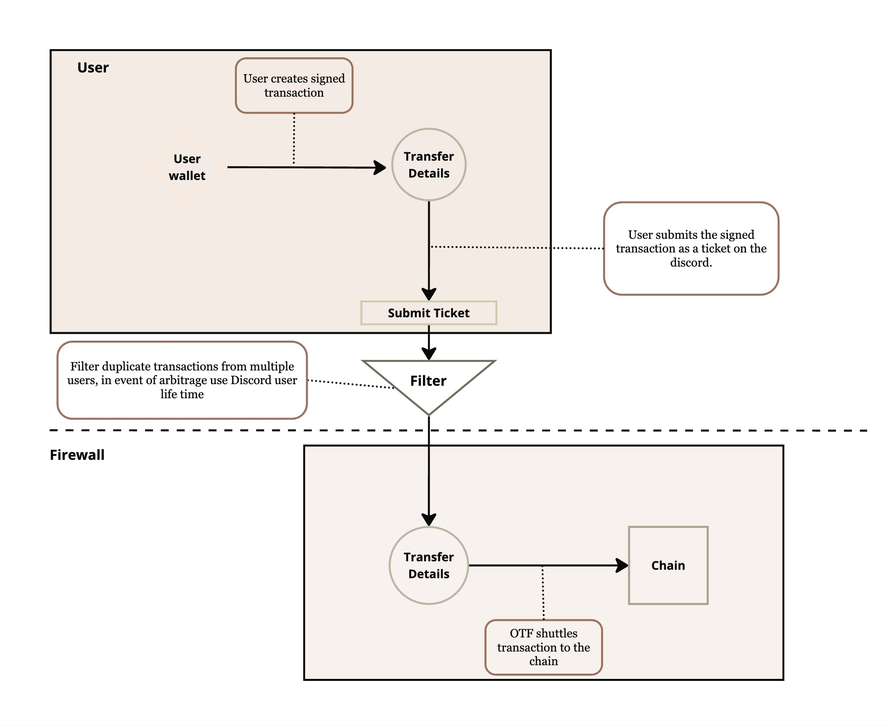

# Safe Transfer



## Introduction

On July 2nd 2024 the Bittensor network experienced hacks on a number of wallets. In reaction to the abrupt and large scale attack the Opentensor Foundation decided to firewall the chain ('make the chain un-accessible to further transactions') until the attack could be contained. In the following day we discovered that the root cause of the attack came from a compromised 6.12.2 version which was latest on PyPy from May 22nd until May 29th 2024 and which leaked wallet mnemonic details to the attacker when users called some wallet functions. It is possible that a large number of wallets that were actively using the Bittensor CLI at that time were compromised by the attack.

This repository is designed to help those users by creating a `safe_transfer` transaction -- a legitimately signed transfer transaction from their potentially compromised wallet -- which will be hand carried across the chain firewall and allowed to execute on the Bittensor Finney network. However, some of the wallets making these transactions could be compromised themselves, and therefore the attacker could create legitimate transactions which we could not discern. To mitigate this risk OTF will perform a process to filter and arbitrate between malicious transactions and those submitted by their previous owners. For details on this process, please refer to the [Arbitration Process](#step-5-arbitration-process) section at the bottom of this document.


## How to create a safe transfer?

1. Users of this script will use the `python safe_transfer.py` function to create a text-based transaction printed on their terminal. 
2. The users will then message the ligitmately signed transaction to a verified member of the Bittensor discord with username 'safe_transfer_helper' within the channel 'safe_transfer' channel.
3. All safe transfers will be collected during a period of X days and will be filtered according to the arbitration process.

---
### Table of Contents
1. [Step 1: Clone the Repository](#step-1-clone-the-repository)
2. [Step 2: Install Requirements](#step-2)
3. [Step 3: Run the script to print the transfer](#step-3)
4. [Step 4: Message the transfer](#step-4)
5. [Step 5: Arbitration Process](#step-5-arbitration-process)

---
### Step 1: Clone the Repository
Git clone this repository on to the device which contains the wallet with the coldkey you suspect is compromised.
```bash
git clone git@github.com:opentensor/safe-transfer.git
```

---
### Step 2
Install the requirements for this repository which simply includes the safe `bittensor>=7.0.0` requirement and `rich` for terminal output colouring.
```bash
cd safe-transfer; python -m pip install -r requirements.txt
```

---
### Step 3 Run the script to print the transfer
Run the `safe_transfer.py` script, passing your old_wallet name and the address to the wallet you want to transfer funds to ss58_encoded.
> Note: 
> 1. this must be run on the machine with the old_wallet who's key is potentially compromised.
> 2. The safe_transfer script does NOT execute this command it simply creates it and prints it to the screen.
> 3. Make sure that YOU own the other wallet who's address you pass to the script. For instance, check for this value on the Bittensor wallet extension.
> Or run `btcli w list` to see the addresses of other wallet's available for the transfer.
```bash
# Fill in the < > items with the correct values.
python safe_transfer.py --old_wallet=<the name of your old wallet> --new_wallet_address=<the ss58_address to the new wallet>

# For example:
python safe_transfer.py --old_wallet=default --new_wallet_address=5DPB62QK6XsSbuFd9g4QAzqq9P5Pzi32P2wBSRS4jdJGLcew
> Print Safe Transfer Transaction?
>        > From wallet name: default with address: 5DPB62QK6XsSbuFd9g4QAzqq9P5Pzi32P2wBSRS4jdJGLcew
>        > To wallet address: 5GhNeygPMJWZ8Z81LeSEXLCXq4Gmtwby7YCHkT1G6nydJU2P

> Enter password to unlock key: 

> ===== Safe Transfer Transaction =====
> --------------------------------------------------
> ###TRANSFER INFORMATION PRINTS HERE IN YELLOW###`
> --------------------------------------------------
> ===== End of Safe Transfer Transaction Details =====
```

---
### Step 4: Message the transfer
Follow these instructions to complete the wallet safe transfer:

   4.a. Review all the items in the transfer details -- displayed in yellow when you run the safe_transfer.py command -- to ensure you are transferring to and from the correct keys. Make sure you have access to the wallet with the new_wallet_address specified; that you have it's mnemonic and that it is stored safely and you have the password available to access it. This is crucial, as you may not be able to access the funds after they have been transferred to the new address if you don't have this information.

   4.b. Copy the text displayed in yellow when you run the safe_transfer.py command. Ensure you copy the entire contents that appear in yellow on your screen.

   4.c. Join or enter the Bittensor Discord server by following this link: https://discord.gg/bittensor

   4.d. Once you have joined the server, navigate to the ⛑・safe_transfer channel. Look for the member in this channel with a purple username "help_safe_transfer". Click on their username and send them a direct message. Paste the yellow details into this direct message. Do not leave the Bittensor Discord after doing this.

   4.e. The verified "help_safe_transfer" user will pass this transaction to the chain. Note that they cannot edit any of the details of this transaction. The chain itself will verify its legitimacy as a normal transaction. The user is merely shuttling the transaction through to the chain.

---
### Step 5: Arbitration Process
The "help_safe_transfer" will inform you if the transfer has been submitted on the chain. Once the chain has been unfirewalled you will be able to check to see this yourself. If the transfer has not been submitted, please submit it again normally with safe-transfer.py command with the added --to_chain flag. 

However some transactions will need to be thrown out if those that have compromised the attack choose to participate in this process also. We will do our best to discriminate between malicious and legitimate transactions in the following way.

> Note, this is simply our best effort, for some cases it might be impossible to arbitrate between legitimate transactions from previous owners and the attacker.
> However, we highly suspect that people affected by this attack were common participants of the Bittensor discord and that we will be able to identify them individually.

The Opentensor Foundation (OTF) will perform the following process to filter and arbitrate between malicious transactions and those submitted by their previous owners:

1. If the transaction is not legitimately signed, the transaction will be removed.

2. If the transaction is legitimately signed and we have not collected other transactions from the same wallet, we will mark the transaction as safe and send it to the chain after a period of X days -- notably before the chain firewall is lifted.

3. If the transaction is signed but there are multiple transactions from the same wallet, we will arbitrate which transaction has precedence.

4. If a user participates in more than 1 arbitrated transaction, neither of their transactions will be included.

5. If the transaction must be arbitrated, we will choose the transaction from the Discord user who has been active in the Bittensor discord longer.

6. If both users during an arbitration are new to the Bittensor discord from within the week, we will discard both transactions.

This arbitration process is designed to maximize the chances of legitimate transactions being processed while minimizing the risk of processing transactions from compromised wallets.