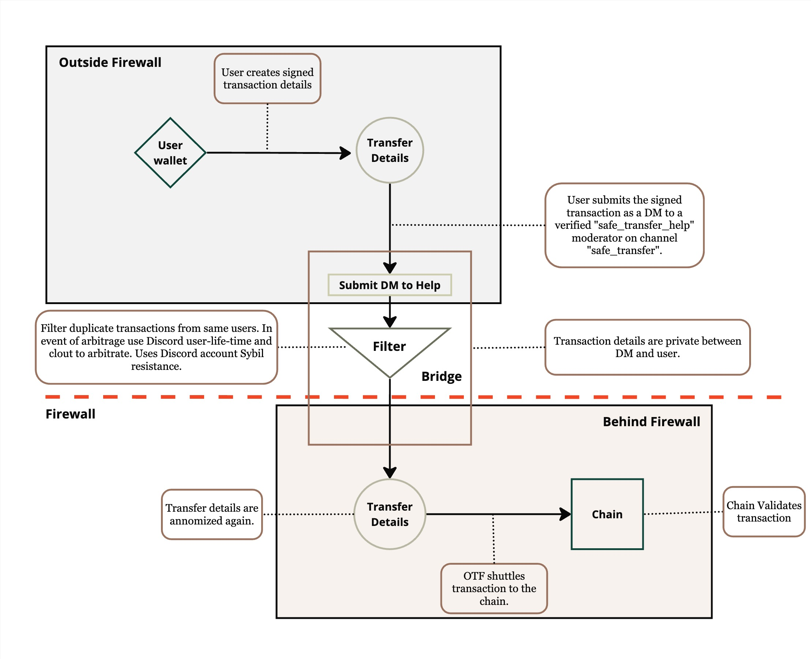

# Optional Safe Transfer


## Introduction

On July 2nd 2024 the Bittensor network experienced hacks on a number of wallets. In response to this abrupt and large scale attack the Opentensor Foundation decided to firewall the chain ("make the chain un-accessible to further transactions") until the attack could be contained. On the following day we (OTF) discovered that the root cause of the attack came from a compromised Bittensor 6.12.2 version, which was latest on PyPy from May 22nd until May 29th 2024 and which leaked the wallet mnemonic details to the attacker when users called some wallet functions. For a detailed report on this incident, see [Bittensor Community Update — July 3, 2024](https://blog.bittensor.com/bittnesor-community-update-july-3-2024-45661b1d542d).

It is possible that a number of wallets that were actively using the Bittensor CLI at that time were compromised by the attack.

This repository is designed to help those users (compromised by the attack) <it is opt in, you do not need to do this> These users will create a `safe_transfer` transaction--a legitimately signed transfer transaction from their potentially compromised wallet. This `safe_transfer` trasaction will then be hand-carried by the OTF across the chain firewall and allowed to execute on the Bittensor Finney network (mainnet). 

Some of the wallets making these `safe_transfer` transactions could be compromised themselves, and therefore the attacker could create legitimate transactions which we (OTF) would not be able to discern. To mitigate this risk OTF will run a process to filter and arbitrate between malicious transactions and those submitted by their previous owners. For details on this process, please refer to the [Arbitration Process](#step-5-arbitration-process) section at the bottom of this document.

## How to create a safe transfer?

1. Users of this script will use the `python safe_transfer.py` function to create a text-based transaction printed on their terminal. 
2. The users will then message the ligitmately signed transaction to a verified member of the Bittensor Discord with username 'safe_transfer_helper' within the channel 'safe_transfer' channel.
3. All safe transfers will be collected during a period of X days and will be filtered according to the arbitration process explained in [Arbitration Process](#step-5-arbitration-process).

---
### Table of Contents
1. [Step 1: Clone the Repository and Install](#step-1-clone-the-repository)
2. [Step 2: Attain a Secure Wallet Address](#step-2)
3. [Step 3: Regenerate your compromised wallet](#step-3)
4. [Step 4: Generate the Transaction String](#step-4)
4. [Step 5: Submit the Transaction Sting](#step-5)
5. [Step 6: Arbitration Process](#step-6-arbitration-process)

---
### Step 1: Clone the Repository
Git clone this repository on to your device from the command line. In the abundance of caution use a machine that was not previously compromised. 
Next, install the requirements for this repository, which simply includes two requirements `bittensor>=7.0.0` and `rich` for terminal output colouring.
```bash
git clone https://github.com/opentensor/safe-transfer.git
cd safe-transfer; python -m pip install -r requirements.txt
```

> Note: IMPORTANT You can check to see if you are running the compromised version of bittensor==6.12.2 before continuing.
```
python -c "import bittensor as bt; print('\nThis version of bittensor is COMPROMISED.' if bt.__version__ == '6.12.2' else '\nYour version of bittensor is SAFE')"
```

---
### Step 2: Attain a Secure Wallet Address
Use an already non-compromised wallet, or create a new one. You can do this any way you please, via a [web wallet](https://bittensor.com/wallet), IOS wallet, or through the bittensor cli itself.
If you wish to use the CLI to create a new wallet, follow these steps.
```bash
# Create the new wallet and list the wallet addresses on the command line
$ btcli wallet new_coldkey --wallet.name MY_NEW_WALLET_NAME
$ btcli wallet list 
```

Example Output:
```bash
$ btcli wallet list 
> Wallets
> ├── 
> │   MY_NEW_WALLET_NAME (5DPB62QK6XsSbuFd9g4QAzqq9P5Pzi32P2wBSRS4jdJGLcew) # This is the wallet address used in the next steps.
```
---

---
### Step 3: Regenerate your compromised wallet
On your safe machine, regenerate your compromised wallet so that you can create the transaction.
```bash
# Regnerate my compromised wallet on my safe machine with name MY_NEW_WALLET_NAME
$ btcli wallet regen_coldkey --wallet.name MY_NEW_WALLET_NAME
```

---

### Step 4: Run the script to print the transfer
Run the `safe_transfer.py` script, passing your `--old_wallet` with your `MY_NEW_WALLET_NAME` name and the ss58_encoded `--new_wallet_address` of the wallet you want to transfer funds to from step 2.

> Note: 
> 1. You must run this on a machine where the old_wallet exists.
> 2. The `safe_transfer.py` script does **NOT execute the transfer** it simply creates it and prints it to the screen.
> 3. Make sure that **YOU** own the other wallet you passed to the script `--new_wallet_address`. For instance, check for this value on the Bittensor wallet extension.
> Or run `btcli w list` to see the addresses of other wallet's available for the transfer.

```bash
# Fill in the < > items with the correct values.
python safe_transfer.py --old_wallet=<the name of your old wallet> --new_wallet_address=<the ss58_address to the new wallet>
```

Example Output:
```bash
python safe_transfer.py --old_wallet=MY_NEW_WALLET_NAME --new_wallet_address=5DPB62QK6XsSbuFd9g4QAzqq9P5Pzi32P2wBSRS4jdJGLcew
> Print Safe Transfer Transaction?
>        > From wallet name: default with address: 5DPB62QK6XsSbuFd9g4QAzqq9P5Pzi32P2wBSRS4jdJGLcew
>        > To wallet address: 5GhNeygPMJWZ8Z81LeSEXLCXq4Gmtwby7YCHkT1G6nydJU2P

## This is the password for the old wallet.
> Enter password to unlock key: 

> ===== Safe Transfer Transaction =====
> --------------------------------------------------
> ###TRANSFER INFORMATION PRINTS HERE IN YELLOW###`
> --------------------------------------------------
> ===== End of Safe Transfer Transaction Details =====
```

---

### Step 5: Send the Transaction
Follow these instructions to send the transfer **to the right person** who will pass it through to the chain.

   4.a. Review all the items in the transfer details to ensure you are transferring to and from the correct keys. This should be a wallet under your control.

   4.b. Copy the text displayed in **yellow** when you run the `safe_transfer.py` command. Ensure you copy the **entire** contents that appear in yellow on your screen.

   4.c. Join or enter the Bittensor Discord server by following this link: [https://discord.gg/bittensor](https://discord.gg/bittensor).

   4.d. Navigate to the `⛑・safe_transfer` channel and find the member who has commented in this channel with the username `help_safe_transfer`. 
   
   4.e. Click on their username and send them a direct message with the **yellow** details into this direct message.

   4.e. The verified `help_safe_transfer` user will give you further instructions.

---

### Step 6: Arbitration Process

There is a chance that two people submit a transfer signed with the same key within the X days that we provide this script. Notably, those two people would be ***you*** and a ***discord user from the attacking group** whom have compromised your keys. This is highly unlikely, however we will perform the following steps to try our best to filter out this attack vector.

1. If one of the users has submitted more than 1 transaction which overlaps with another user, then both of their transactions will be discarded. This will force the attacking group to use many unique discord accounts. 

2. If both users have submitted more than 1 transaction which overlaps (required arbitration) we will remove both transactions.

3. If both users have only submitted 1 transaction and there is an overlap, we will ask both to provide a cryptographic signature from an acocunt which previously transfered funds to the wallet address in question prior to July 2nd 2024.

4. If only one can provide the above signature this transfer will be used and the other disgarded.

5. If both users can provide this signature or if none can provide this signature we will take into account both the time when the user entered the Bittensor Discord and how active the user is in the Discord as indication of legitimacy -- in this event we may reach out the community at large for help referencing the user, however there is no guarantee that this process will be conclusive.

6. If step 5 remains inconclusive we will discard both transactions and not pass them through to the chain.

This arbitration process is designed to maximize the chances of legitimate transactions being processed while minimizing the risk of processing transactions from compromised wallets. However, there may still be cases with extremely low probability that we cannot determine the legitimacy of the keys. 

```bash
# The MIT License (MIT)
# Copyright © 2024 Opentensor Foundation

# Permission is hereby granted, free of charge, to any person obtaining a copy of this software and associated
# documentation files (the “Software”), to deal in the Software without restriction, including without limitation
# the rights to use, copy, modify, merge, publish, distribute, sublicense, and/or sell copies of the Software,
# and to permit persons to whom the Software is furnished to do so, subject to the following conditions:

# The above copyright notice and this permission notice shall be included in all copies or substantial portions of
# the Software.

# THE SOFTWARE IS PROVIDED “AS IS”, WITHOUT WARRANTY OF ANY KIND, EXPRESS OR IMPLIED, INCLUDING BUT NOT LIMITED TO
# THE WARRANTIES OF MERCHANTABILITY, FITNESS FOR A PARTICULAR PURPOSE AND NONINFRINGEMENT. IN NO EVENT SHALL
# THE AUTHORS OR COPYRIGHT HOLDERS BE LIABLE FOR ANY CLAIM, DAMAGES OR OTHER LIABILITY, WHETHER IN AN ACTION
# OF CONTRACT, TORT OR OTHERWISE, ARISING FROM, OUT OF OR IN CONNECTION WITH THE SOFTWARE OR THE USE OR OTHER
# DEALINGS IN THE SOFTWARE.
```
